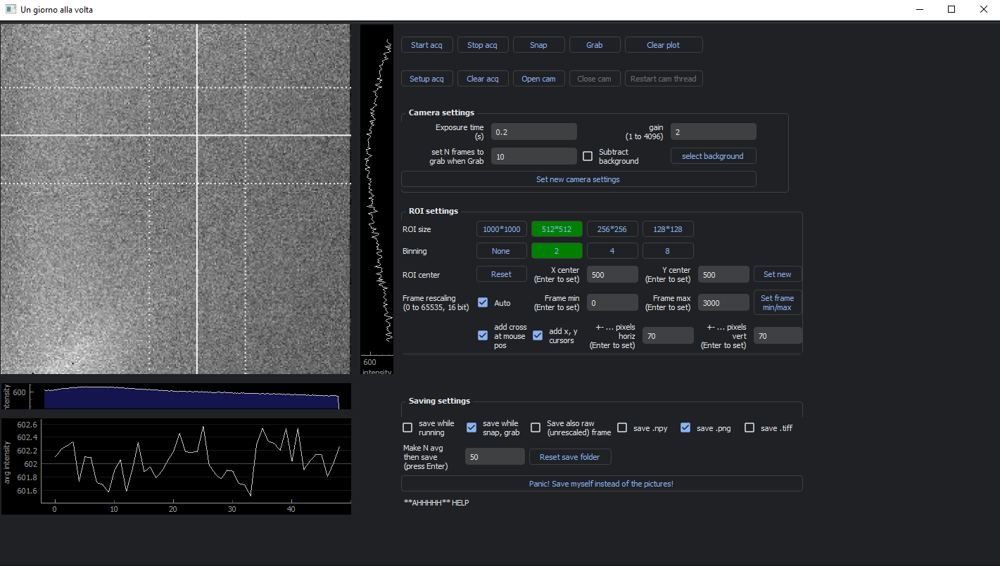

# camera-app-pyqt-pylablib
A program for scientific cameras supported by pylablib written in PyQt5 for Python.
The specific program is implemented for Andor Luca cameras, but you can easily change it to any camera supported by pylablib ([list here](https://pylablib.readthedocs.io/en/latest/devices/cameras_root.html)) and, with a bit more work, possibly to any python-supported scientific camera.
Designed in Qt Designer with the aim of integrating it further in custom PyQt programs.

# Features
  - livestream of frames at many ROI (size, center), gain, exposure time
  - directly save (png, tiff, npy) the livestream with automatic naming of folder and files with a precise timestamp and current settings
  - optionally subtract a background image
  - mouse-based pointer on the frame with additional cursors
  - plots with image integrals and image average in time
  - easily embeed it into your PyQt program for your own experiment
  - naively implemented in numpy: frames are ndarray directly from pylablib
  - a panic button for those really bad, bad days

# Usage
1) Install packages (check or use the requirements.txt file directly):
    - install PyQt5 using pip to the latest version. Versions < 5.12 do not support 16 bit Grayscale format for qimage. At the moment the one via conda is < 5.12, so don't use conda, use pip
    - PIL (pillow) for conversion to png, tiff and image manipulation
    - pylablib, of course
    - numpy, datetime, re, sys, os, time
    - qdarktheme if you want the dark theme
    - tested with Python 3.11

2) Run program as main
or else, embeed it into your own PyQt5 program, like
    `from AndorCameraApp import CameraApp`
    `self.myCameraApp = CameraApp()`

3) Change default settings to your taste
   -  in the camera app instance: `verbose=False`, if True prints lots of stuff to console; `dummy_camera=False`, if True runs the program without a physical camera, faking one; `directory_to_save_images=r'./img'` to save your images...; `darktheme=False` to use the dark theme provided by `qdarktheme`
   - default camera exposure time and gain can be changed manually in the init method of the CameraHandler class
   - some other minor default values (like max/min frame intensity, cursor x,y) are defined in the initis metods of the two threads
  
4) Connect the pyqtSignals you might need to the rest of your program
In the `CameraThread` class, you can use `processGrabFrames` to send the frames obtained via `Grab` to your program.
Otherwise, in the `ProcessingThread` class you have the signals `frameSignalToGui`, `horizontalSignal`, `verticalSignal`, `avgSignal` that can be used to send repsectively the whole frame, its integrals horiz/vert, or just the mean of the frame.
This part is still a bit under progress.

# Use with a different camera supported by pylablib
This program works with Andor Luca, but a little tweaking should make it work with any camera supported by pylablib, as the main functions are the same.

You can start by changing the imports:

`pll.par["devices/dlls/andor_sdk2"] = "C:\Program Files\Andor Driver Pack 2"`

`from pylablib.devices import Andor`

 and the definition of the `self.cam` variable in the `CameraHandler` class:
 
`self.cam = Andor.AndorSDK2Camera(idx=0, temperature=-20, fan_mode='full')`
to match your camera.

If some methods fail, go thorough the `CameraHandler` class and check if methods are missing or working differently.

# Known bugs and limitations
1) **Speed and framerate**
The measured framerate is less the the given one. When resing the ROI to 512*512 and using some binning, this amounts in around 50 ms of delay for every frame, so quite acceptable.
Is more noticeable  with bigger frames at full resolution.
Can be in part due to the bandwidth limitation of the Andor Luca tested, in part due to the processing done in Python on the frames themselves.
The processing is implemented via multithreading, but the multithreading of PyQt and Python in general does not allow to use different physical cores, resulting in an accumulation of times (the time to acquire the frame + to process it).
At small roi and binning the framerate is fast enough (fastest doable with Luca is 50 ms, after which the GUI start to slow down coniderably).

2) **Sending frames to another PyQt5 program**
Still not sure about which pyqSignal to use and where. The possible signals are listed above, but there is a bit of confusion.

3) **Closing the program**
At the moment it works without trowing any error, but when trying to re-open it (from another program), it just does not work. Why? Mmhh some fishy stuff going on with threads
# Code structure

There are 4 classes: the `CameraHandler` class, that wraps pylablib functions; the `CameraThread` class, a `QThread` that keeps on getting the frames from the camera; the `ProcessingThread` class, another QThread, that gets the raw frames from the CameraThread and process them, either for plotting or for saving; the `CameraApp` class that inherits from QMainWindow, is the actualy GUI and where all the other classes are defined.

#### CameraHandler
Optional values in init: `frame_period = 0.001, exposure_time=0.2, gain=2, stabilize_temp=False, binning=1`.
Frame period is for usage of fixed framerate, but is never used here and thus set to a negligibe value.
If stabilize_temp, the code will wait for the camera to cool down (to -20 C for Andor Luca). 
Binning can be 1, 2, 4, 8, 16. Like while setting a smaller ROI, both ROI and binning are passed to the camera and thus reduce the hardware time needed to acquire and process the frame, directly at the camera.
The set_ROI function has a check to see whether the new roi, at the new coordinates of the center, would actually fit or go over the borders. In the latter case, everything is resized properly.

The `snap` method acquire a single frame from the camera, and does so by stopping the acquisition, snap, then start the acquisition.
The `grab` method acquire mutliple frames similarly to the snap method.
The livestream uses `wait_for_frame`, that is like a time.sleep till the camera has a new frame in the buffer, toghether with `read_oldest_image`

#### CameraThread

This QThread keeps on running. 
Most of its time will be spent waiting for frames or, if acquisition is not running, waiting at a time.sleep for a time equal to the exposure time.
With the 4 pyQtSignals defined before the init this thread can send the raw frames to the ProcessingThread for processing, for saving or when the Grab button is pressed.
All those booleans are ugly but effective: when clicking a button on the GUI the respective bool will turn True, stop acquisition, change the parameter, start acquisition. Ugly but effective. 
There is a special flag to kill the while True neatly.

#### ProcessingThread

This QThread also keeps on running (maybe ugly) and receives the raw frames to either process them for the GUI or to save them.
The processing involves rescaling the frame intensity, converting the 12-bit grayscale from Andor Luca to 16 bit grayscale, subtracting the background, computing integrals and mean value, adding lines for the mouse-based cursor.
The saving routine checks which extension to save, rescale the frame, convert the ndarry to png or tiff using PIL, and saves the image to the correct path. When saving while livestream, it will sum up frame after frame and only save when the given number of averages is reached.
The code will create, in the given path, the folder of the day (YYYY_MM_DD) and save the files like 2024_02_06_00000_15.20.53.513_im_s_exp0.2_gain2. First the year, month, date. Then a number that starts at 0 up to 99999. Then the timestamp of when the frame was taken. Then "s" for snap, "g" for grab or "r20" for running with 20 frames average, finally the exposure time in seconds and the gain

#### CameraApp

The GUI. The interface is made via Qt Designer and setup with setupUI().
All the variables, including camera and the two QThreds, are defined in `initVariables` function.
Finally the `connectUi` function connects all the buttons with the appropriate functions.
Follows the definition of all the relevant functions to make the GUI works
